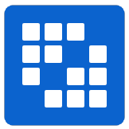

## About me


### `Hello` I'm Juan Daniel Cavero Tovar.


My username is @danielex1999:

```
Embrace your dreams, and, whatever happens protect your honor...as SOLDIER 
```

---

# Biography

### :books: I'm currently learning

<code><a href="https://github.com/danielex1999" target="_blank"></a></code>
<code><a href="https://github.com/danielex1999" target="_blank"></a></code>
<code><a href="https://github.com/danielex1999" target="_blank"></a></code>
<code><a href="https://github.com/danielex1999" target="_blank"></a></code>
<code><a href="https://github.com/danielex1999" target="_blank"></a></code>
<code><a href="https://github.com/danielex1999" target="_blank"></a></code>
<code><a href="https://github.com/danielex1999" target="_blank"></a></code>

### :file_folder: Learned technologies

<code><a href="https://www.selenium.dev" target="_blank"></a></code>
<code><a href="https://github.com/danielex1999/JavaScript-Course" target="_blank"></a></code>
<code><a href="https://github.com/danielex1999/Java-Course" target="_blank"></a></code>
<code><a href="https://github.com/danielex1999" target="_blank"></a></code>
<code><a href="https://github.com/danielex1999" target="_blank"></a></code>
<code><a href="https://github.com/danielex1999/danielex1999/blob/main/resources/keyboard-shortcuts-windows.pdf" target="_blank"></a></code>
<code><a href="https://github.com/danielex1999/danielex1999/blob/main/resources/IntelliJIDEA_ReferenceCard.pdf" target="_blank"></a></code>
<code><a href="https://github.com/danielex1999" target="_blank"></a></code>
<code><a href="https://github.com/danielex1999/danielex1999/blob/main/resources/github-git-cheat-sheet.pdf" target="_blank"></a></code>
<code><a href="https://github.com/danielex1999" target="_blank"></a></code>
<code><a href="https://github.com/danielex1999" target="_blank"></a></code>

---

<p align="center">

</p>
